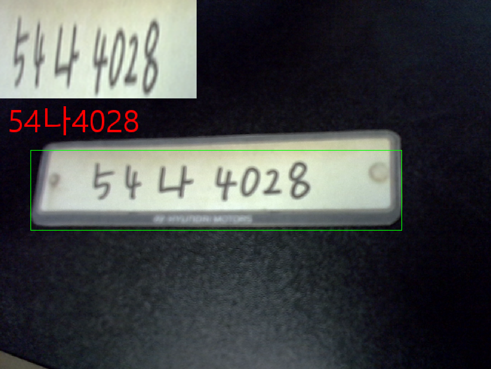
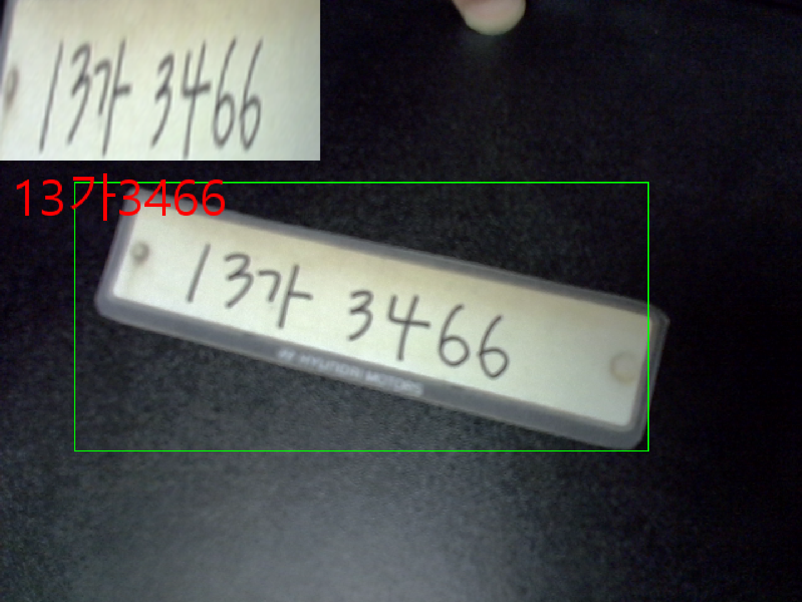
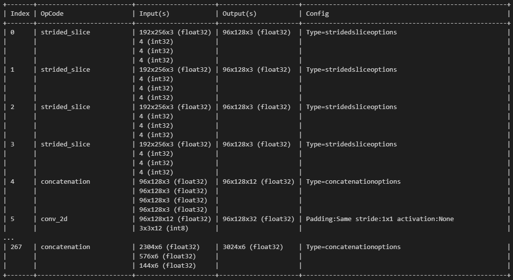
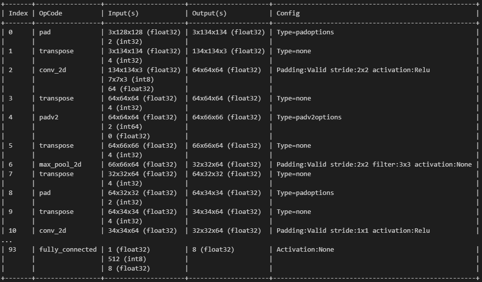
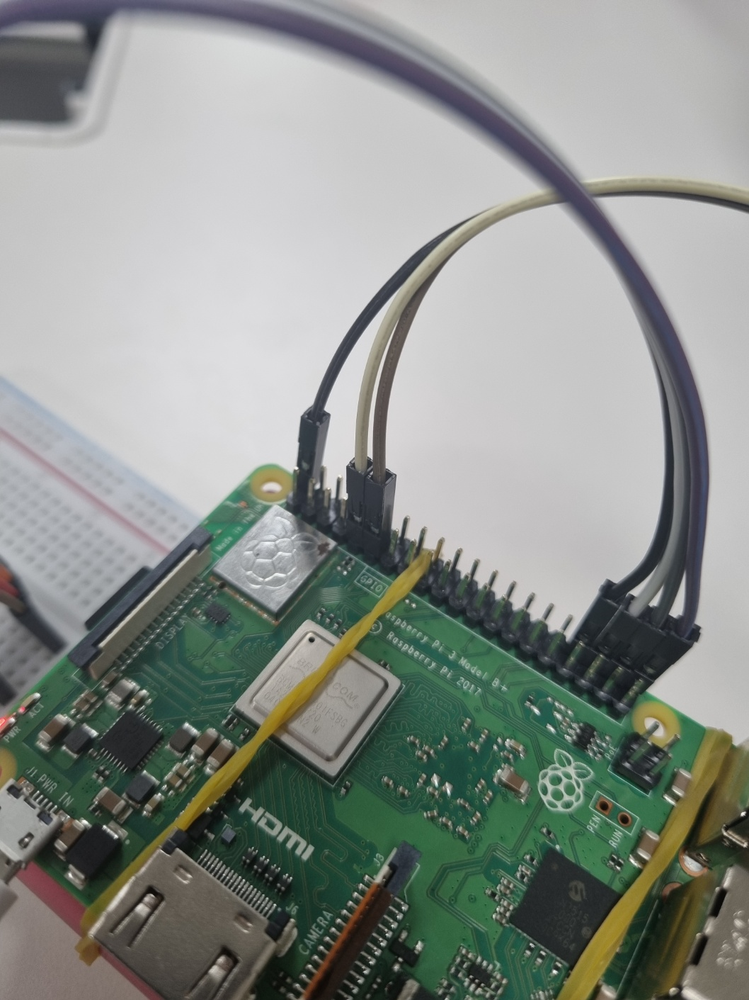
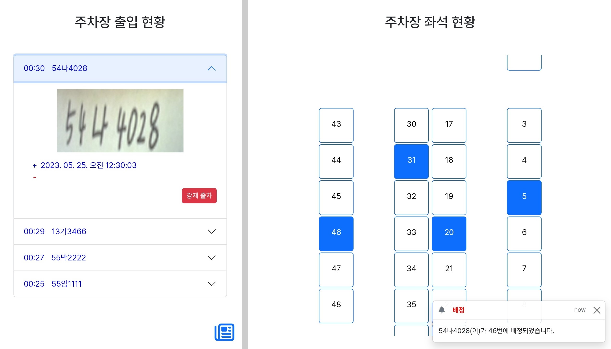

# ANPR 주차장 차단기 with Raspberry Pi

## 1. 개발환경
- python: 3.9
- raspberrypi 3 B+ (aarch64)
## 2. 프로젝트 개요
- 주차관리어플리케이션 제작의 일부분.
- 차량 출입 기록 및 주차장 내부 차량 추적/관리의 목적
- 차단기를 통해 유효한 차량번호인지 판단하는 과정이 필요함.
    - 등록차량은 입차허가(True), 미등록차량은 입차불가(False)
    - 미등록차량: 차량등록 미수행, 위약자
## 3. 차량번호인식 및 유효차량검증 과정
<p align="center"></p>

1. 차량번호판인식: 불필요한 글자를 거르기 위한 과정.
2. 번호판 꼭지점 추론: 번호판 원근 변환을 위한 꼭지점 추출.
3. 차량번호인식: 인식된 번호판 BBOX에 대해 글자 인식.
4. 유효차량검증: 차량번호가 유효한지 서버로 전송.
5. 센서제어: 차단기 작동
6. 입차기록: 입차 사실을 2번 결과 이미지와 함께 서버로 전송.
### 3.1 차량번호판인식(LPBboxDetectionModel)
- YOLOv5 모델 사용
    - input size: 1x192x256x3
    - output size: 1x3024x6
- get_bbox(): 1x3024x6 -> 2x5
- ROI 그리기
<details>
<summary>모델 자세히보기</summary>
<p align="center"></p>
</details>

### 3.2 번호판 꼭지점 추론(LPVertexDetectionModel)
- timm으로 사전학습된 Resnet18 모델
<details>
<summary>모델 자세히보기</summary>
<p align="center"></p>
</details>

### 3.3 차량번호인식(LPOcrModel)
- Naver clova OCR API 사용

### 3.4 유효차량검증(HttpService)
- 서버에서 DB에 저장된 차량 중에서 결격유무 판단
- True 또는 False로 리턴
    - True면, 모터 및 LED 제어
    - False면, nothing

### 3.5 센서제어(barrier_control_thread)
- LED
    - r=GPIO 16, g=GPIO 20, b=GPIO 21
    - ground
- 서보모터
    - GPIO 17
    - 5V power
    - ground
- GPIO 핀번호와 아래 사진속 번호와 혼동 주의
<p align="center"></p>

### 3.6 번호판 업로드(HttpService)
- 입차 기록에 필요한 번호판 인식 결과 이미지 서버로 전송
- 서버로 전송된 이미지는 관리자 웹 페이지에서 조회 가능
<p align="center"></p>

## 4. 프로젝트 결과
<p align="center"></p>

## 5. 프로젝트 사용방법
### 5.1 한글 폰트 설정
```
export LANG=en_US.UTF-8
export LC_ALL=en_US.UTF-8
echo "set encoding=utf-8" >> ~/.vimrc
sudo apt-get install fonts-nanum
sudo dpkg-reconfigure locales
```
### 5.2 pigpio 라이브러리를 데몬으로 시작
```
sudo apt-get update
sudo apt-get install pigpio python-pigpio python3-pigpio
sudo pigpiod
```
### 5.3 프로젝트 clone 
```
git clone [repository]
cd [repository]
```
### 5.4 python 가상환경 및 라이브러리 설치
```
python3.9 -m pip install virtualenv
python3.9 -m virtualenv venv
source venv/bin/activate

pip install pigpio
pip install opencv-python
pip install Pillow
pip install requests requests_toolbet
pip install tensorflow tflite-runtime==2.11.0

python Main.py
```
### 5.5 HTTP 서비스 사용을 위한 .ini 파일 정의
```
[SERVER]
URL = <your host>
CHECK_VALIDATION = <vehicle's number check api>
UPLOAD = <upload api>

[OCR]
API_URL = <your naver clova ocr api url>
SECRET_KEY = <your secret key>
```
